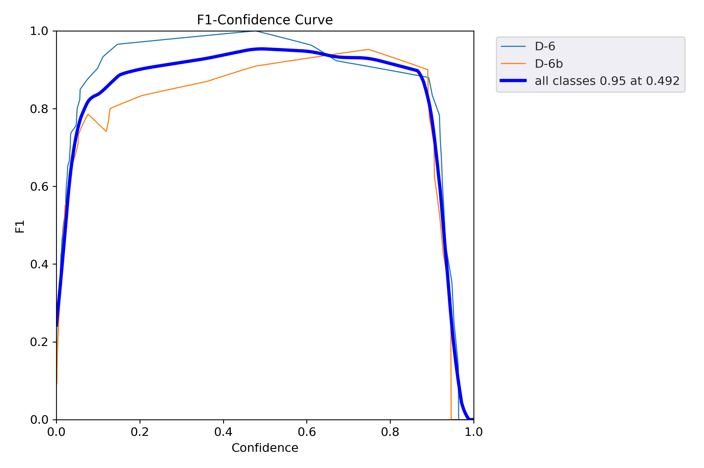
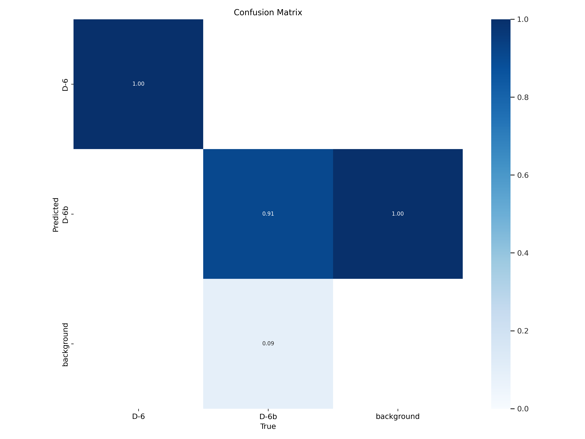
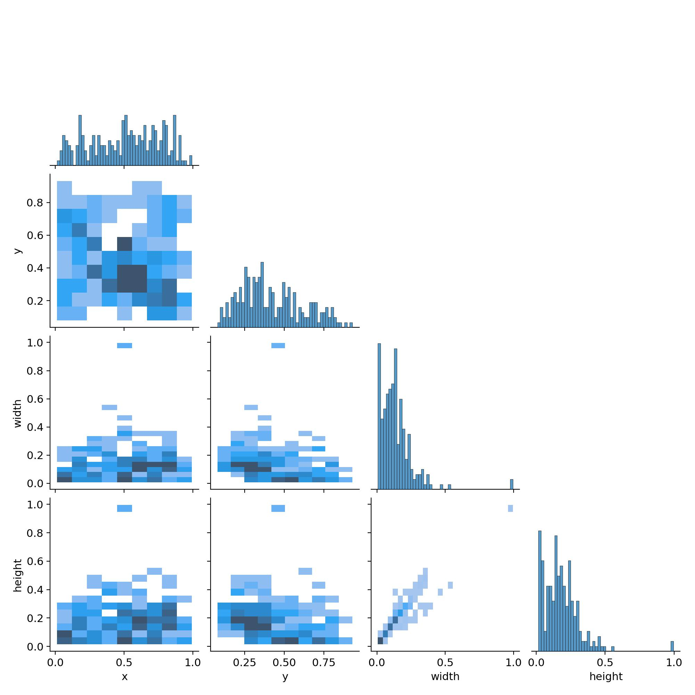
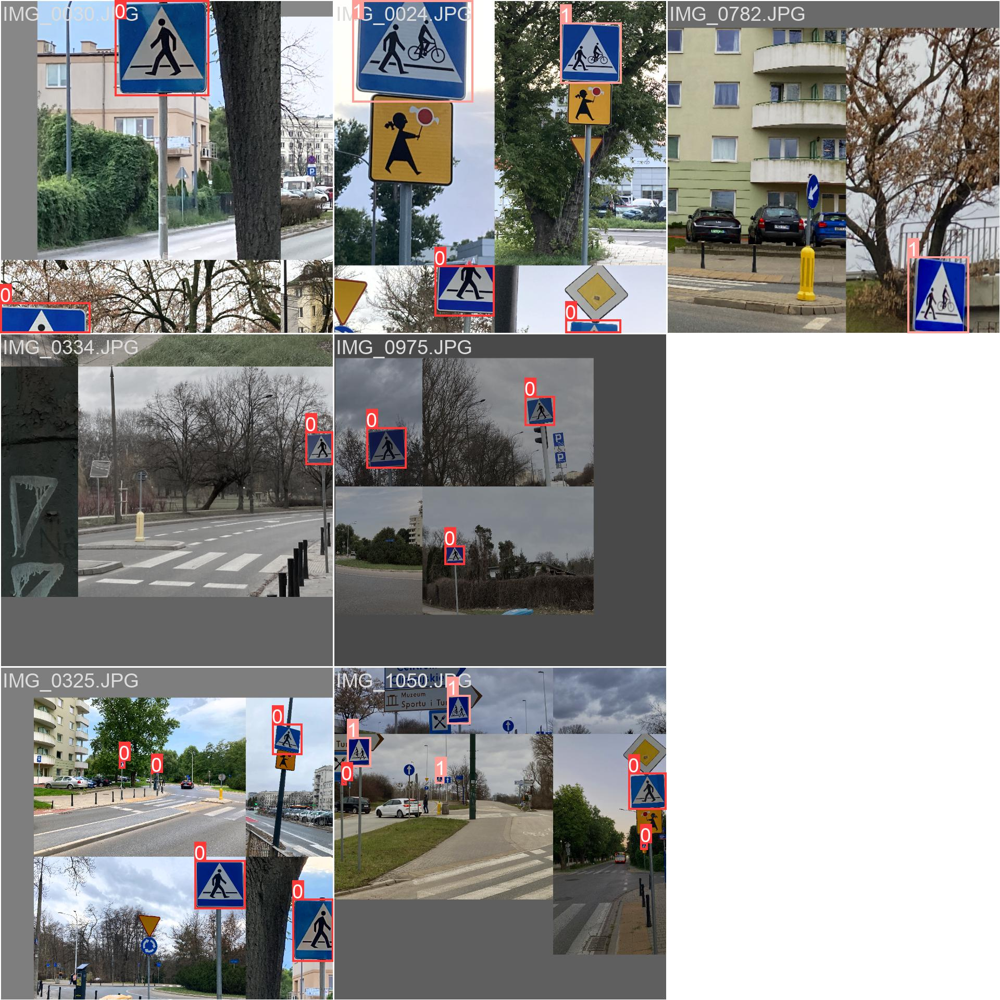
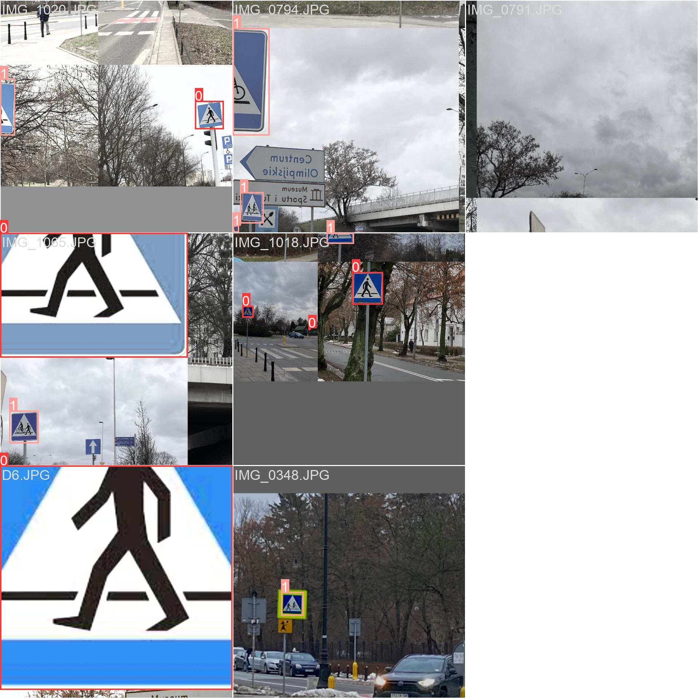
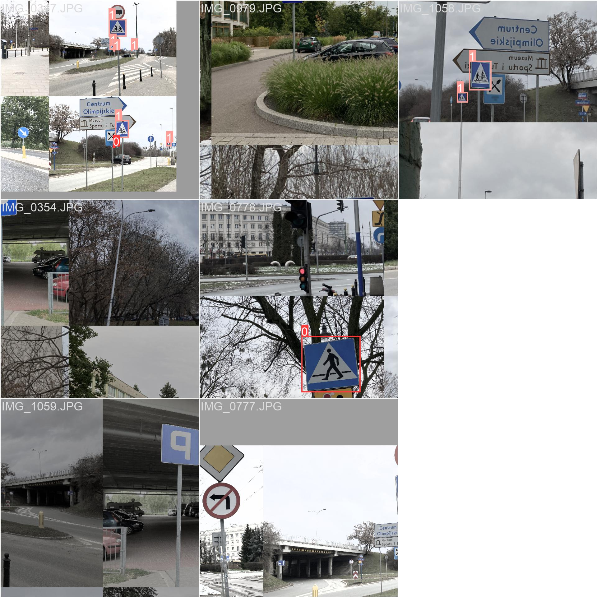
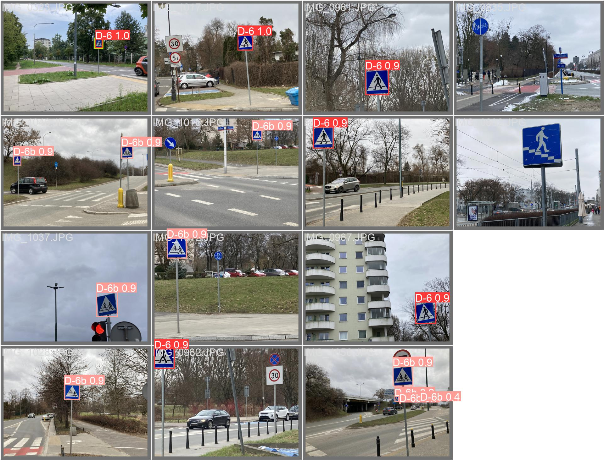
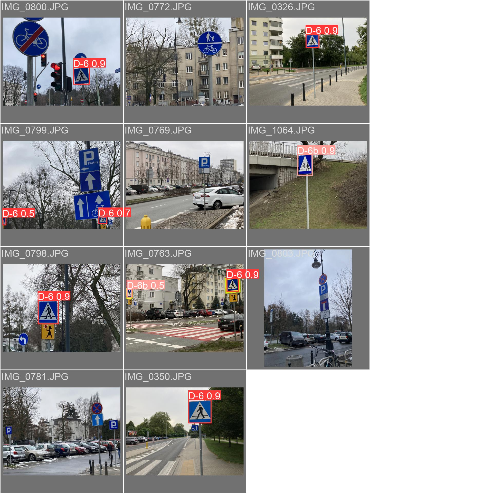

# YOLOv5 Custom-Trained Model for [D6](https://pl.m.wikipedia.org/wiki/Plik:PL_road_sign_D-6.svg) and [D6b](https://pl.m.wikipedia.org/wiki/Plik:PL_road_sign_D-6b.svg) Road Signs Detection
This repository contains a custom-trained [YOLOv5](https://github.com/ultralytics/yolov5) model for detecting [D6](https://pl.m.wikipedia.org/wiki/Plik:PL_road_sign_D-6.svg) and [D6b](https://pl.m.wikipedia.org/wiki/Plik:PL_road_sign_D-6b.svg) road signs. The model has been trained on a custom dataset to recognize and classify these road signs accurately.

## Overview
[YOLOv5](https://github.com/ultralytics/yolov5) is an efficient, real-time object detection system that is widely used for a variety of computer vision tasks. This custom-trained model can be used for road sign detection, which has various practical applications in the field of autonomous vehicles, traffic management, and safety.

## Training
The model has been trained on a specific dataset, which is not included in this repository. You can train a similar model on your own dataset by following the instructions in the [YOLOv5](https://github.com/ultralytics/yolov5) repository.

## Results
The model's performance on the training and validation datasets is showcased below:

## Contributing
Contributions and improvements are welcome. If you have suggestions or would like to report an issue, please open a new GitHub issue or submit a pull request.

## License
This project is licensed under the MIT License. See the [LICENSE](LICENSE) file for details.
